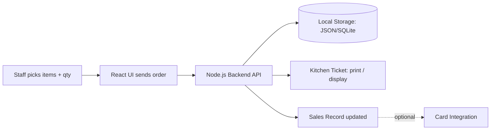
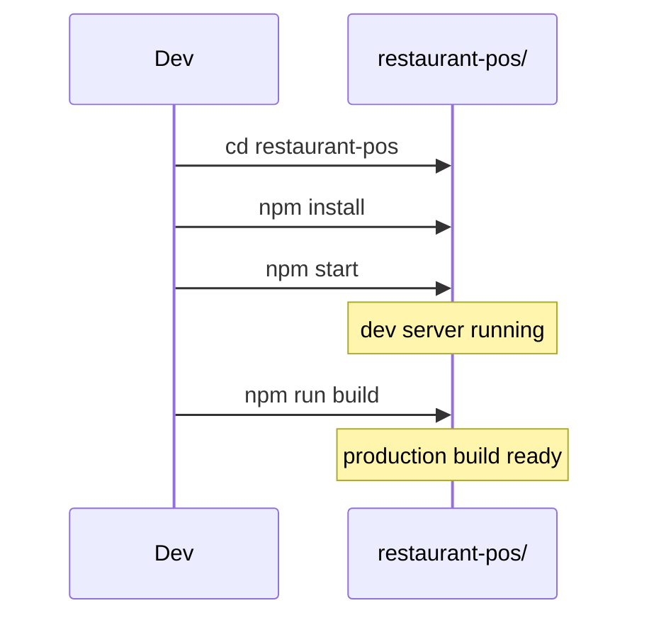

<div align="center">


<a href="#">
  
</a>

<br/>


</div>

<p align="center">
  
  
  
  
</p>

<div align="center">
  
  <br/>
  <sub><i>↑ swap this GIF for a real screen recording of an order being placed → sent to kitchen → paid — <a href="https://www.screentogif.com/">ScreenToGif</a> or <a href="https://github.com/phw/peek">Peek</a> work well</i></sub>
</div>

---

## 📖 Table of Contents

<details open>
<summary>Click to expand</summary>

- [Purpose](#-purpose)
- [Tech Stack](#-tech-stack)
- [How It Works](#-how-it-works-high-level)
- [Highlights](#-highlights)
- [Quick Start](#-quick-start)
- [Menu Editing](#-menu-editing)
- [License](#-license)

</details>

---

## 🎯 Purpose

<table align="center">
<tr>
<td align="center" width="260">⚡<br/><b>Streamline Ordering</b><br/><sub>Order taking, kitchen tickets, daily reconciliation</sub></td>
<td align="center" width="260">⏱️<br/><b>Reduce Wait Times</b><br/><sub>Fewer mistakes, faster tickets</sub></td>
</tr>
</table>

---

## 🛠 Tech Stack

<div align="center">


</div>

| Layer | Tech |
|---|---|
| **Frontend** | React (JSX) for the renderer UI |
| **Backend** | Node.js for local API and business logic |
| **Storage** | Lightweight local storage (JSON/SQLite) for fast local operations |
| **Build** | npm for package management |

---

## ⚙️ How It Works (High Level)



1. Staff select items from the menu, adjust quantities, and send orders to the backend.
2. Orders are recorded locally and can be printed or displayed for the kitchen.
3. Payments update sales records immediately; card integrations can be added.

---

## ✨ Highlights

<details open>
<summary><b>📶 Offline-First</b></summary>
<br/>
Continues to accept orders when internet is unavailable.
</details>

<details open>
<summary><b>📝 Simple Menu Editing</b></summary>
<br/>
Edit the menu via JSON files for quick, no-fuss updates.
</details>

<details open>
<summary><b>🪶 Small &amp; Fast</b></summary>
<br/>
Lightweight footprint — suitable for low-cost hardware.
</details>

---

## 🚀 Quick Start



### 1️⃣ Install dependencies

```bash
cd restaurant-pos
npm install
```

### 2️⃣ Run (development)

```bash
npm start
```

### 3️⃣ Build for production

```bash
npm run build
```

---

## 🍽 Menu Editing

Menus are plain JSON — no database migrations, no build step needed to add or reprice an item.

```json
{
  "id": "burger-classic",
  "name": "Classic Burger",
  "price": 5.99,
  "category": "Burgers",
  "available": true
}
```

Update the file, save, and the POS picks up the new menu on next load.

---

## 📸 Want More?

Want screenshots, a demo GIF, or a developer-focused technical summary? See the LinkedIn post or open an issue in the repo.

---

## 📄 License

_Add your preferred license here (e.g. MIT, Apache-2.0, GPL-3.0)._

---

<div align="center">


<sub>Papa-z POS — built for speed in the kitchen 🍔</sub>

</div>
